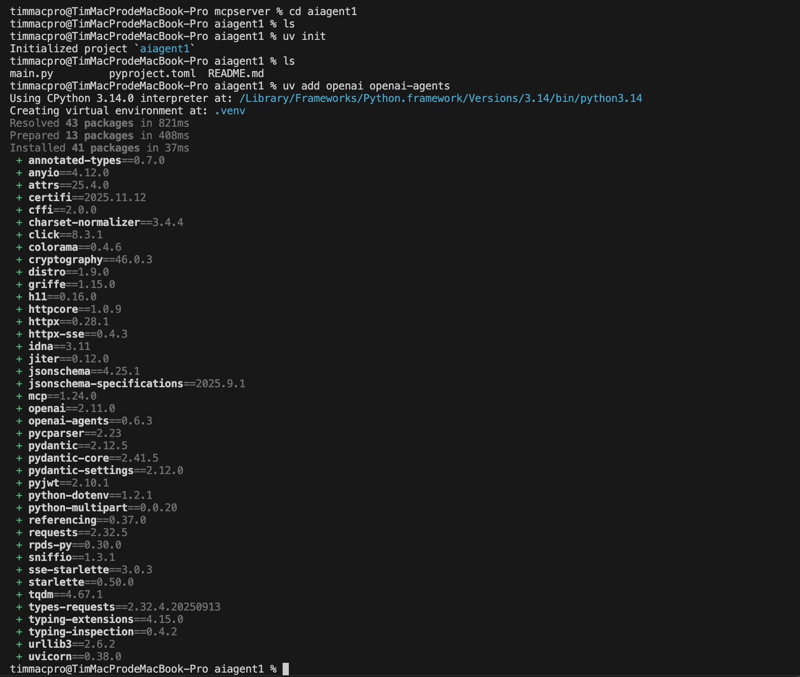
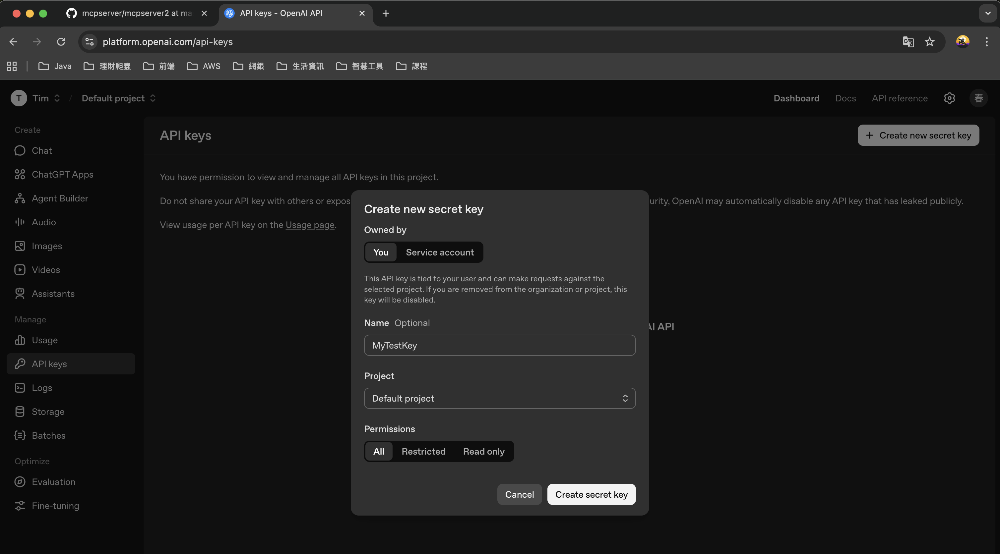
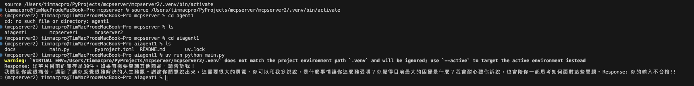

# AI Agent 多代理系統範例

## 專案簡介

這是一個基於 **OpenAI Agents SDK** 建立的多代理系統（Multi-Agent System）範例專案，展示如何整合多個 AI Agent 協同工作，並透過 **MCP (Model Context Protocol) Server** 連接外部服務。

### 主要目的

本專案旨在示範以下核心概念和技術：

1. **多 Agent 協作架構**：展示如何建立多個專業化的 Agent，各司其職
2. **Agent Handoff 機制**：實現 Agent 之間的智能轉交與協作
3. **MCP Server 整合**：透過 HTTP 連接外部 MCP 伺服器，擴展 Agent 的功能
4. **輸入安全防護 (Input Guardrails)**：實現內容審核和安全檢查機制
5. **串流回應處理**：展示如何處理即時串流輸出

## 系統架構

本系統包含三個主要的 Agent：

### 1. 總經理小助手 (General Manager Assistant)
- **角色**：系統的主要入口點
- **功能**：接收所有使用者請求，並智能判斷是否需要轉交給專業助手
- **特色**：配備輸入安全防護機制，可攔截不當請求

### 2. 庫存小幫手 (Inventory Assistant)
- **角色**：專業的庫存查詢助手
- **功能**：透過 MCP Server 連接外部庫存系統，提供即時庫存資訊
- **技術**：使用 MCPServerStreamableHttp 連接遠端服務

### 3. 心理諮詢助手 (Therapy Assistant)
- **角色**：情感支持與心理諮商助手
- **功能**：處理情感困擾、提供心理支持和建議
- **特色**：使用串流輸出，提供更自然的對話體驗

### 安全防護機制

- **內容審核 Agent**：自動分類使用者輸入（庫存查詢/心理諮詢/一般問題）
- **Tripwire 機制**：自動攔截含有暴力、違法、色情等不當內容的請求

## 使用場景範例

專案包含三個測試案例：

1. **庫存查詢**：「洋芋片還有多少庫存」→ 轉交給庫存小幫手查詢
2. **心理諮詢**：「我好痛苦，請幫我解決人生難題」→ 轉交給心理諮詢助手
3. **不當請求**：「我想要做偏門生意」→ 被安全防護機制攔截

## 安裝步驟

### 1. 建立專案目錄

```bash
mkdir aiagent1
cd aiagent1
```

### 2. 初始化 Python 專案

使用 `uv` 指令初始化專案：

```bash
uv init
```

**執行後會自動產生以下檔案：**
- `.gitignore` - Git 版本控制忽略檔案
- `.python-version` - Python 版本指定檔案（建議使用 Python 3.10 以上）
- `main.py` - 主程式檔案
- `pyproject.toml` - 專案設定檔
- `README.md` - 專案說明文件

### 3. 安裝相依套件

安裝 OpenAI 和 OpenAI Agents SDK：

```bash
uv add openai openai-agents
```



**主要套件說明：**
- `openai`：OpenAI 官方 Python SDK
- `openai-agents`：OpenAI Agents 框架，提供 Agent、Runner、MCP 等功能

### 4. 撰寫程式碼

參考專案中的 `main.py`，主要包含：
- 環境設定與 API 金鑰載入
- MCP Server 連線設定
- 三個 Agent 的定義與配置
- 安全防護機制實作
- 測試案例執行

### 5. 申請 OpenAI API Key

1. 前往 [OpenAI Platform](https://platform.openai.com/)
2. 登入後進入 API Keys 頁面
3. 點擊「Create new secret key」建立新的 API 金鑰
4. 妥善保存金鑰（只會顯示一次）



### 6. 設定環境變數

將 OpenAI API Key 設定為環境變數：

```bash
export OPENAI_API_KEY="your-api-key-here"
```

或在專案根目錄建立 `.env` 檔案：
```
OPENAI_API_KEY=your-api-key-here
```

### 7. 啟動 MCP Server

本專案需要連接外部的 MCP Server（`mcpserver2`）提供庫存查詢功能。

**啟動前置作業：**
1. 確認 `mcpserver2` 專案已經啟動
2. 使用 ngrok 建立反向代理，將本地 MCP Server 暴露到公網
3. 將 ngrok 提供的 URL 更新到 `main.py` 的 `mcp_server` 設定中

```python
mcp_server = MCPServerStreamableHttp(
    params = {
        "url": "https://your-ngrok-url.ngrok-free.dev/mcp"  # 更新為您的 ngrok URL
    },
    cache_tools_list=True
)
```

### 8. 執行程式

一切就緒後，透過以下指令啟動 Agent：

```bash
uv run python main.py
```

**程式執行流程：**
1. 連接到 MCP Server
2. 執行測試案例 1：查詢洋芋片庫存
3. 執行測試案例 2：心理諮詢（串流輸出）
4. 執行測試案例 3：不當請求測試（會被攔截）
5. 清理 MCP Server 連線

程式執行結果範例：




## 注意事項

1. **API 金鑰安全**：請勿將 OpenAI API Key 提交到版本控制系統
2. **MCP Server 連線**：執行前確保 MCP Server 已啟動並可正常連接
3. **模型選擇**：程式使用 `gpt-4.1` 模型，請確認您的帳號有相應權限
4. **網路連線**：需要穩定的網路連線以存取 OpenAI API 和 MCP Server
5. **費用控管**：OpenAI API 為計費服務，請注意使用量

## 技術特色

- **非同步處理**：使用 `asyncio` 實現高效能的非同步操作
- **型別安全**：使用 `Pydantic` 進行資料驗證和序列化
- **模組化設計**：各 Agent 職責明確，易於擴展和維護
- **錯誤處理**：完善的異常處理機制，包含 Tripwire 熔斷保護
- **串流輸出**：支援即時串流回應，提升使用者體驗

## 參考資源

- [OpenAI Agents SDK 文件](https://github.com/openai/openai-agents-sdk)
- [Model Context Protocol (MCP)](https://modelcontextprotocol.io/)
- [OpenAI API 參考文件](https://platform.openai.com/docs/)

## 參考書籍
- **AI Agent 奇幻旅程** - MCP 通往異世界金鑰

