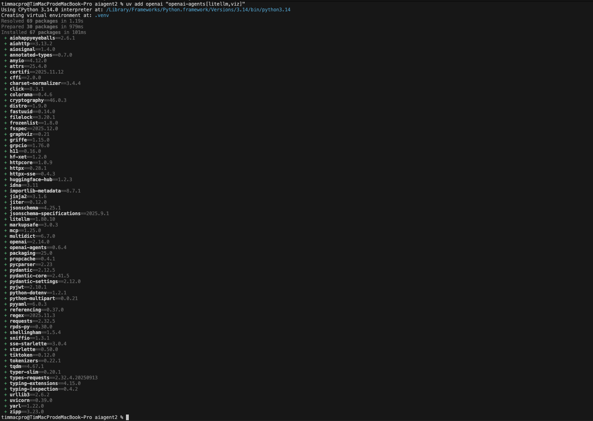
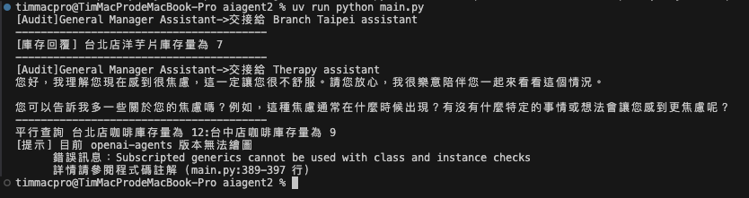

# AI Agent 多代理工作流範例

## 專案簡介

這是一個基於 **OpenAI Agents SDK** 建立的多代理工作流系統範例專案，展示如何整合多個 AI Agent 協同工作，並透過 **LiteLLM** 支援多種 LLM 提供商（如 Gemini、Claude 等）。

### 主要目的

本專案旨在示範以下核心概念和技術：

1. **多 Agent 協作架構**：展示如何建立多個專業化的 Agent，各司其職
2. **Agent Handoff 機制**：實現 Agent 之間的智能轉交與協作
3. **LiteLLM 整合**：透過 LiteLLM 支援多種 LLM 提供商（OpenAI、Gemini、Claude 等）
4. **多店舖庫存系統**：展示如何為不同分店建立專屬的查詢工具
5. **輸入安全防護 (Input Guardrails)**：實現內容審核和安全檢查機制
6. **串流回應處理**：展示如何處理即時串流輸出
7. **平行查詢處理**：使用 asyncio 實現高效能的並發查詢

## 系統架構

本系統包含五個主要的 Agent：

### 1. 總經理小助手 (General Manager Assistant)
- **角色**：系統的主要入口點和協調者
- **功能**：接收所有使用者請求，並智能判斷是否需要轉交給專業助手
- **特色**：配備輸入安全防護機制，可攔截不當請求
- **使用模型**：OpenAI GPT-5

### 2. 台北店助手 (Branch Taipei Assistant)
- **角色**：專業的台北店庫存查詢助手
- **功能**：提供台北店商品庫存查詢服務
- **使用模型**：OpenAI GPT-5

### 3. 台中店助手 (Branch Taichung Assistant)
- **角色**：專業的台中店庫存查詢助手
- **功能**：提供台中店商品庫存查詢服務
- **使用模型**：OpenAI GPT-5

### 4. 心理諮詢助手 (Therapy Assistant)
- **角色**：情感支持與心理諮商助手
- **功能**：處理情感困擾、提供心理支持和建議
- **特色**：使用串流輸出，提供更自然的對話體驗
- **使用模型**：**Google Gemini 2.5 Flash**（透過 LiteLLM 整合）

### 5. 內容審核助手 (Guardrail Check)
- **角色**：輸入內容安全審核
- **功能**：自動分類使用者輸入（庫存查詢/心理諮詢/一般問題）
- **特色**：Tripwire 機制，自動攔截含有暴力、違法、色情等不當內容的請求
- **使用模型**：OpenAI GPT-5

### 安全防護機制

- **內容審核 Agent**：自動分類使用者輸入（庫存查詢/心理諮詢/一般問題）
- **Tripwire 機制**：自動攔截含有暴力、違法、色情等不當內容的請求

## LiteLLM 整合說明

### 什麼是 LiteLLM？

**LiteLLM** 是一個統一的 LLM API 介面，讓你可以使用相同的程式碼調用不同的 LLM 提供商，包括：
- OpenAI（GPT-4、GPT-5）
- Google（Gemini、PaLM）
- Anthropic（Claude）
- Cohere
- 以及 100+ 種其他 LLM 提供商

### 為什麼使用 LiteLLM？

1. **統一介面**：不需要為每個 LLM 提供商學習不同的 API
2. **靈活切換**：可以輕鬆在不同模型之間切換，無需修改大量程式碼
3. **成本優化**：根據任務需求選擇最適合的模型（如簡單任務使用 Gemini Flash）
4. **容錯備援**：主要模型故障時可以自動切換到備用模型

### 本專案中的 LiteLLM 使用

在本專案中，我們使用 LiteLLM 整合 **Google Gemini 2.5 Flash** 模型來提供心理諮詢服務：

```python
# 導入 LiteLLM 模型支援
from agents.extensions.models.litellm_model import LitellmModel
import litellm

# 設定 LiteLLM
litellm.suppress_debug_info = True  # 抑制除錯訊息
litellm.drop_params = True           # 自動移除不支援的參數

# 取得 Gemini API 金鑰
gemini_api_key = os.getenv("GEMINI_API_KEY")

# 設定 Gemini 模型名稱
gemini_model = os.getenv("GEMINI_MODEL", "gemini/gemini-2.5-flash")

# 建立使用 Gemini 的心理諮詢助手
therapy_agent = Agent(
    name="Therapy assistant",
    instructions="你是一位具備同理與專業知識的心理諮商助手．",
    model=LitellmModel(
        model=gemini_model,      # 使用 Gemini 模型
        api_key=gemini_api_key   # Gemini API 金鑰
    ),
)
```

### LiteLLM 模型名稱格式

LiteLLM 使用 `提供商/模型名稱` 的格式：
- `gemini/gemini-2.5-flash` - Google Gemini 2.5 Flash
- `gemini/gemini-pro` - Google Gemini Pro
- `claude-3-opus` - Anthropic Claude 3 Opus
- `gpt-4` - OpenAI GPT-4

## 使用場景範例

專案包含三個測試案例：

1. **庫存查詢**：「台北店洋芋片還有多少?」→ 轉交給台北店助手查詢
2. **心理諮詢**：「我最近很焦慮，該怎麼辦?」→ 轉交給心理諮詢助手（使用 Gemini 模型）
3. **平行查詢**：同時查詢台北店和台中店的咖啡庫存

## 安裝步驟

### 1. 建立專案目錄

```bash
mkdir aiagent2
cd aiagent2
```

### 2. 初始化 Python 專案

使用 `uv` 指令初始化專案：

```bash
uv init
```

**執行後會自動產生以下檔案：**
- `.gitignore` - Git 版本控制忽略檔案
- `.python-version` - Python 版本指定檔案（建議使用 Python 3.10 以上）
- `main.py` - 主程式檔案
- `pyproject.toml` - 專案設定檔
- `README.md` - 專案說明文件

### 3. 安裝相依套件

安裝 OpenAI 和 OpenAI Agents SDK，包含 LiteLLM 與 Graphviz 擴充套件：

```bash
uv add openai "openai-agents[litellm,viz]"
```



**主要套件說明：**
- `openai`：OpenAI 官方 Python SDK
- `openai-agents`：OpenAI Agents 框架，提供 Agent、Runner、Handoff 等功能
- `litellm`：統一的 LLM API 介面（透過 `[litellm]` 擴充安裝）
- `graphviz`：代理結構視覺化工具（透過 `[viz]` 擴充安裝）

### 4. 撰寫程式碼

參考專案中的 `main.py`，主要包含：
- 環境設定與 API 金鑰載入
- LiteLLM 設定與 Gemini 整合
- 五個 Agent 的定義與配置
- 安全防護機制實作
- 測試案例執行

### 5. 申請 OpenAI API Key

1. 前往 [OpenAI Platform](https://platform.openai.com/)
2. 登入後進入 API Keys 頁面
3. 點擊「Create new secret key」建立新的 API 金鑰
4. 妥善保存金鑰（只會顯示一次）

### 6. 申請 Google Gemini API Key

1. 前往 [Google AI Studio](https://aistudio.google.com/apikey)
2. 登入 Google 帳號
3. 點擊「Get API Key」或「Create API Key」
4. 複製並妥善保存 API 金鑰

### 7. 設定環境變數

將 API 金鑰設定為環境變數：

```bash
export OPENAI_API_KEY="your-openai-api-key-here"
export GEMINI_API_KEY="your-gemini-api-key-here"
```

或在專案根目錄建立 `.env` 檔案：
```
OPENAI_API_KEY=your-openai-api-key-here
GEMINI_API_KEY=your-gemini-api-key-here
GEMINI_MODEL=gemini/gemini-2.5-flash
```

### 8. 執行程式

一切就緒後，透過以下指令啟動 Agent：

```bash
uv run python main.py
```

**程式執行流程：**
1. 執行範例 1：查詢台北店洋芋片庫存（展示 Agent 自動交接功能）
2. 執行範例 2：心理諮詢（展示 LiteLLM 整合 Gemini 與串流輸出）
3. 執行範例 3：平行查詢台北店和台中店咖啡庫存（展示並發處理）

## 程式執行結果

執行程式後，你會看到類似以下的輸出：

```
[Audit] General Manager Assistant 將使用工具 handoff
[Audit] handoff 完成，結果：...
[Audit]General Manager Assistant->交接給 Branch Taipei assistant
[Audit] Branch Taipei assistant 將使用工具 get_inventory
[Audit] get_inventory 完成，結果：台北店洋芋片庫存量為 7
----------------------------------------
[庫存回覆] 台北店洋芋片庫存量為 7

----------------------------------------
[Audit] General Manager Assistant 將使用工具 handoff
[Audit]General Manager Assistant->交接給 Therapy assistant
焦慮是一種常見的情緒反應...（使用 Gemini 模型的串流輸出）

----------------------------------------
平行查詢 台北店咖啡庫存量為 12:台中店咖啡庫存量為 9
```



## 注意事項

1. **API 金鑰安全**：請勿將 OpenAI API Key 和 Gemini API Key 提交到版本控制系統
2. **模型選擇**：
   - 程式使用 `gpt-5` 模型作為主要模型，請確認您的帳號有相應權限
   - Gemini 模型使用 `gemini-2.5-flash`，這是成本較低且速度較快的版本
3. **網路連線**：需要穩定的網路連線以存取 OpenAI API 和 Google Gemini API
4. **費用控管**：
   - OpenAI API 為計費服務，請注意使用量
   - Gemini API 有免費額度，但超過後也會收費
5. **LiteLLM 設定**：
   - 確保已設定 `litellm.drop_params = True`，避免不相容參數導致錯誤
   - 不同 LLM 提供商支援的功能可能不同

## 技術特色

- **非同步處理**：使用 `asyncio` 實現高效能的非同步操作和並發查詢
- **型別安全**：使用 `Pydantic` 進行資料驗證和序列化
- **模組化設計**：各 Agent 職責明確，易於擴展和維護
- **錯誤處理**：完善的異常處理機制，包含 Tripwire 熔斷保護
- **串流輸出**：支援即時串流回應，提升使用者體驗
- **多模型支援**：透過 LiteLLM 整合多種 LLM 提供商，靈活選擇最適合的模型
- **生命週期監控**：使用 `AgentHooks` 追蹤代理執行過程，便於除錯
- **動態工具生成**：使用工廠函數為不同分店建立專屬查詢工具
- **平行查詢**：使用 `asyncio.gather` 實現高效能的並發操作

## LiteLLM 優勢總結

1. **降低成本**：可根據任務複雜度選擇不同價格的模型
2. **提高可用性**：主要模型故障時可自動切換備用模型
3. **簡化開發**：統一的 API 介面，減少學習成本
4. **靈活擴展**：輕鬆添加新的 LLM 提供商，無需大幅修改程式碼
5. **最佳化效能**：根據任務特性選擇最適合的模型（速度 vs 品質）

## 擴展建議

如果你想進一步擴展此專案，可以考慮：

1. **添加更多 LLM 提供商**：
   ```python
   # 使用 Anthropic Claude
   claude_agent = Agent(
       name="Claude assistant",
       model=LitellmModel(
           model="claude-3-opus",
           api_key=os.getenv("ANTHROPIC_API_KEY")
       ),
   )
   ```

2. **實現模型路由**：根據任務類型自動選擇最適合的模型
3. **添加緩存機制**：減少重複查詢的 API 調用次數
4. **整合向量資料庫**：實現更智能的上下文檢索
5. **建立 Web 介面**：提供更友善的使用者互動介面

## 參考資源

- [OpenAI Agents SDK 文件](https://github.com/openai/openai-agents-sdk)
- [LiteLLM 官方文件](https://docs.litellm.ai/)
- [Google Gemini API 文件](https://ai.google.dev/docs)
- [OpenAI API 參考文件](https://platform.openai.com/docs/)
- [Python asyncio 教學](https://docs.python.org/3/library/asyncio.html)
- [Pydantic 文件](https://docs.pydantic.dev/)

## 參考書籍
- **AI Agent 奇幻旅程** - MCP 通往異世界金鑰

