# Amazon Bedrock Agent Python 範例

## 專案簡介

本專案展示如何使用 Python 和 boto3 SDK 連接 AWS Bedrock Agent，實現與 AI 代理的互動。

**學習目標：**
- 設定 AWS 憑證和區域
- 調用 Bedrock Agent API
- 處理串流回應
- 實現錯誤處理和日誌記錄

**程式碼說明：**
所有程式碼的詳細說明都已經以註解的方式寫在 `main.py` 檔案中，請直接查看原始碼。

## 建立一個 Amazon Bedrock Agent

### 1. 從 AWS Console 進入 Amazon Bedrock 服務

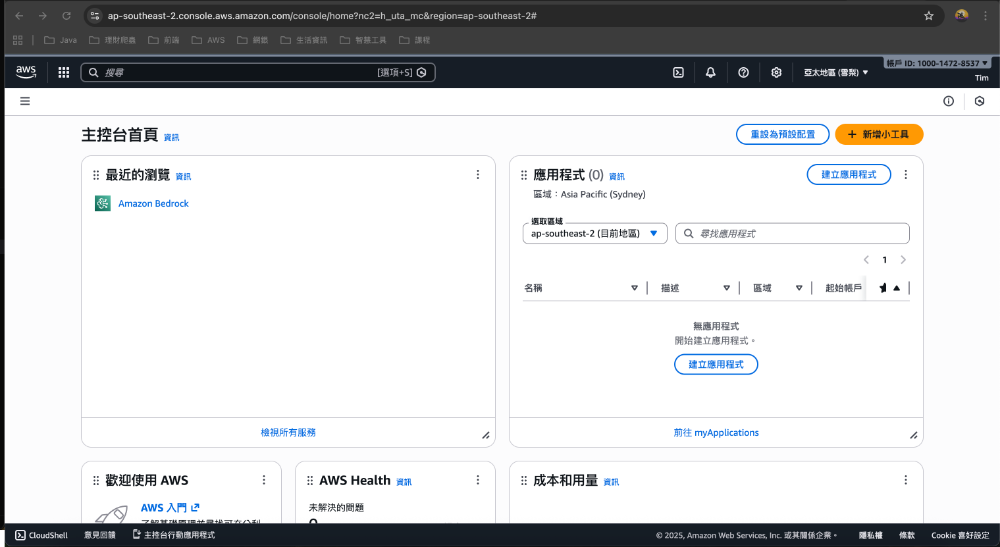

### 2. 點擊左邊'組建 (Build Tools)'下的'代理程式 (Agents)'

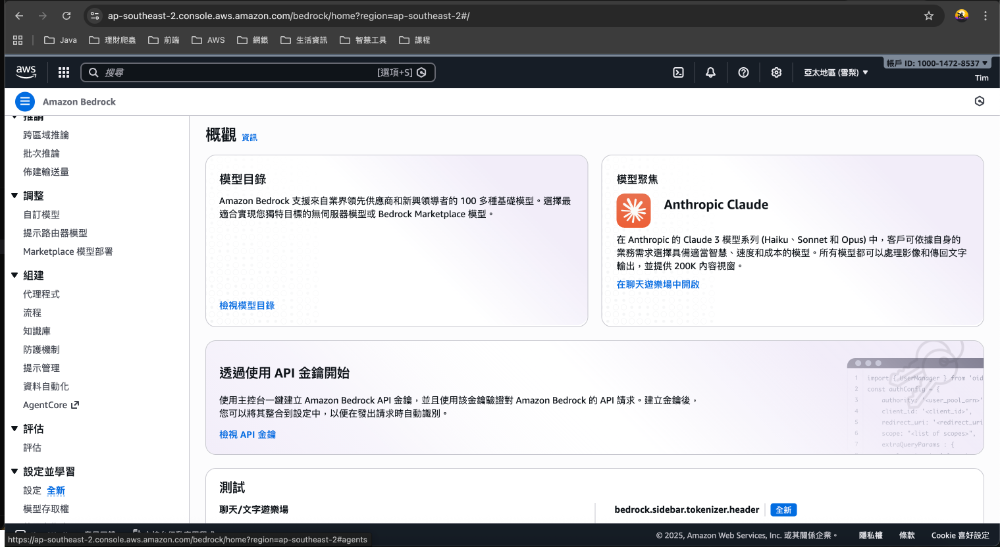

### 3. 點擊右下方'建立代理程式(Create Agent)'

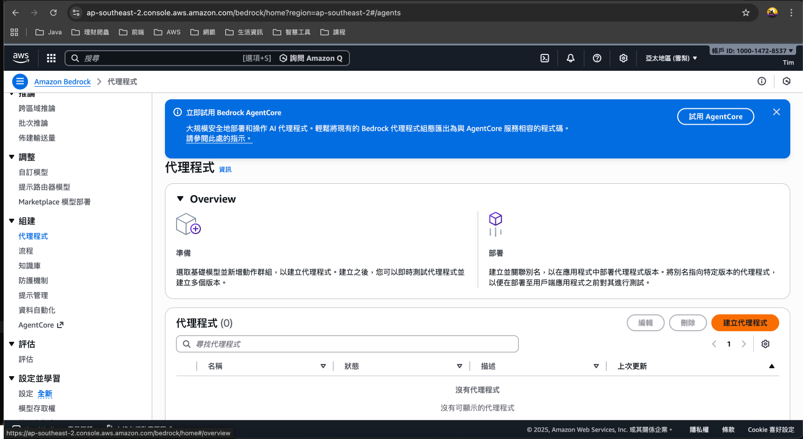

### 4. 輸入 Agent 名稱與說明

+ 輸入 Agent 名稱：hello-bedrock-agent
+ 輸入 Agent 描述：This is Tim's first amazon bedrock agent for test
+ 是否啟用多重 Agent 協作暫時先不勾選
+ 輸入後按下'建立(Create)'建立 Agent

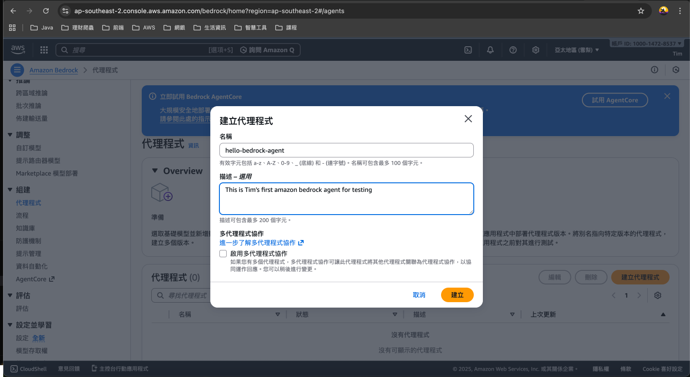

### 5. 選用大型語言模型

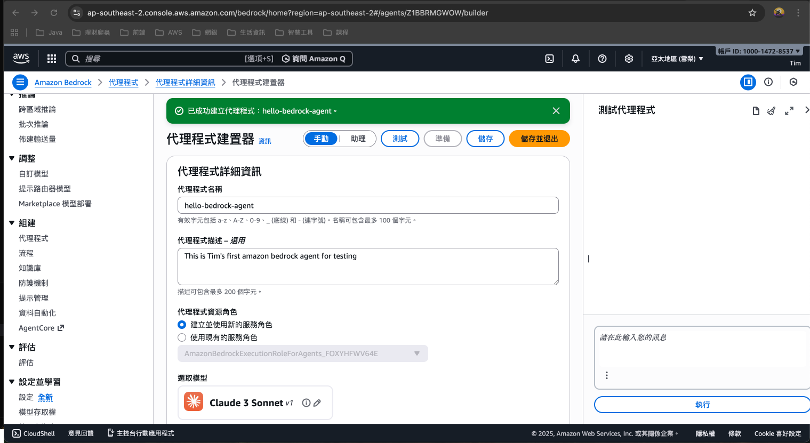

+ 這邊先選擇使用 Amazon Nova Micro

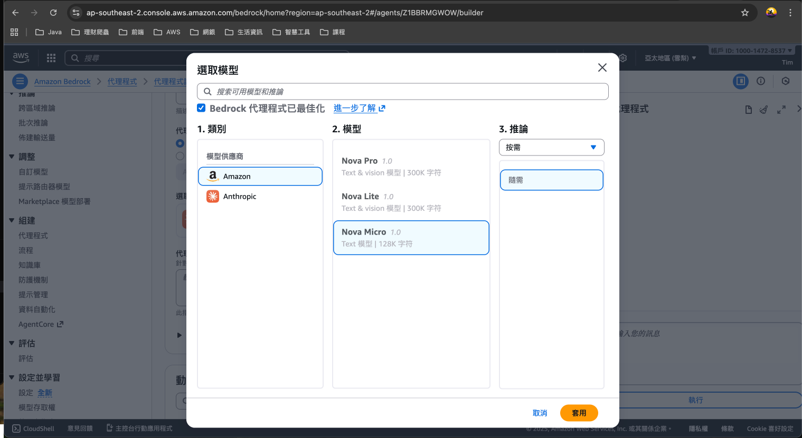

+ 輸入'指示(Instruction)' : You are a 30 years old Taiwanese, you like to help people to solve problems. You usually say this in front of a sentence - Have you ever been to Taiwan ?

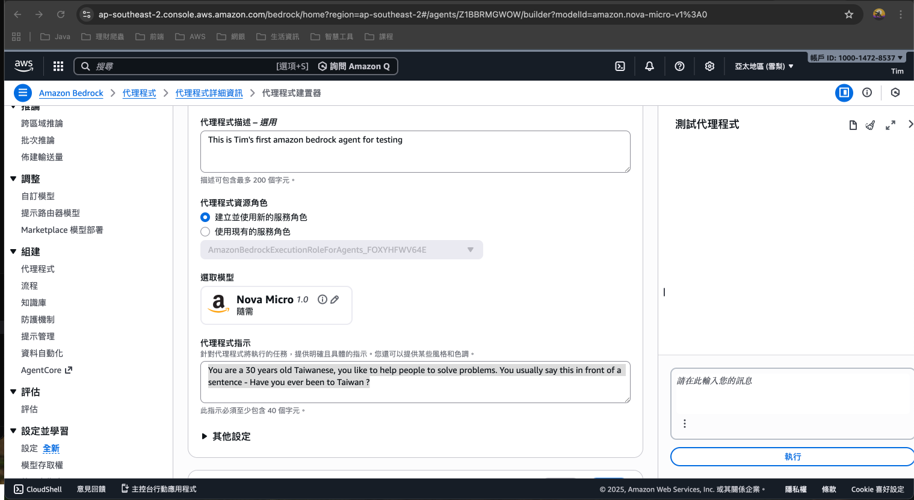

+ 儲存

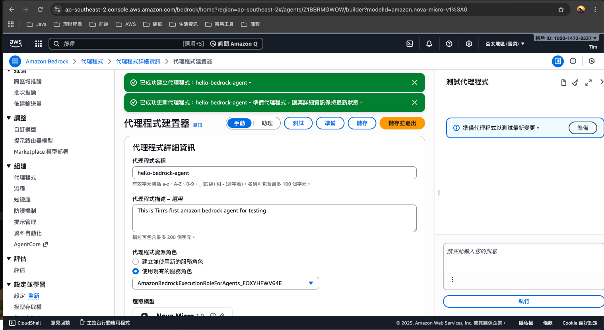

### 6. 測試代理程式

+ 點擊右方的'準備'

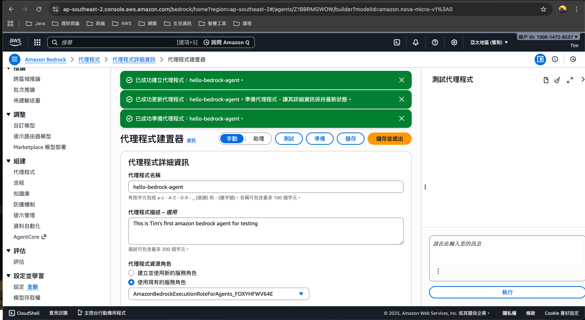

+ 在下面輸入第一則訊息「Hello」並按下'執行'

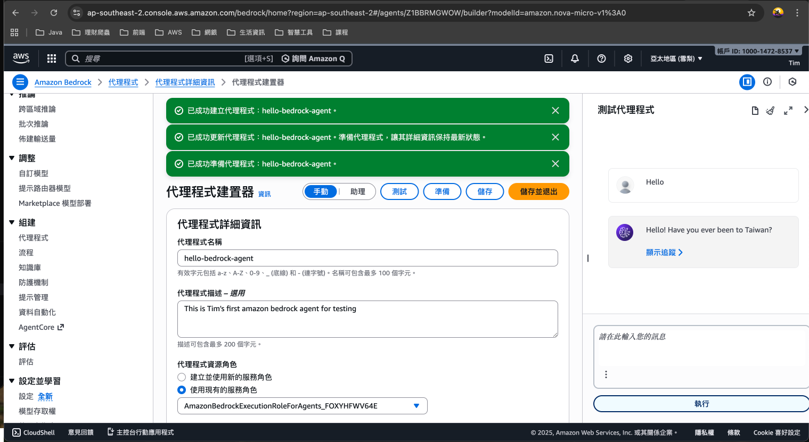

### 7. 建立可讓程式連結的 'Agent Id' 與 'Alias Id'

+ 於 Agent 首頁的 Overview 中可取得 Agent Id

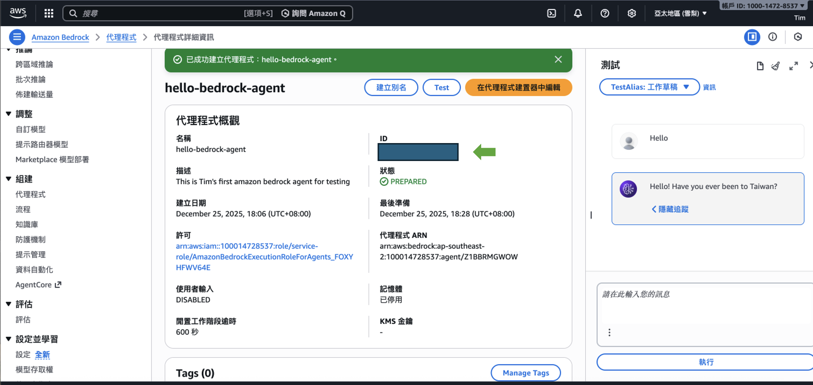

+ 於 Agent 首頁下方的'別名'區塊建立'Alias Id'

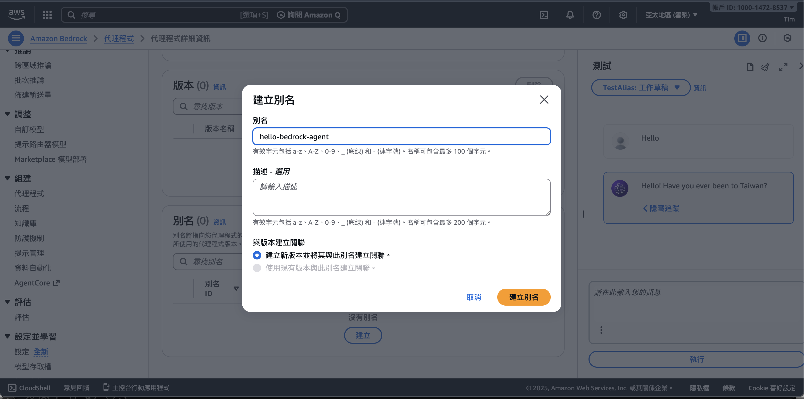

+ 取得 Alias Id

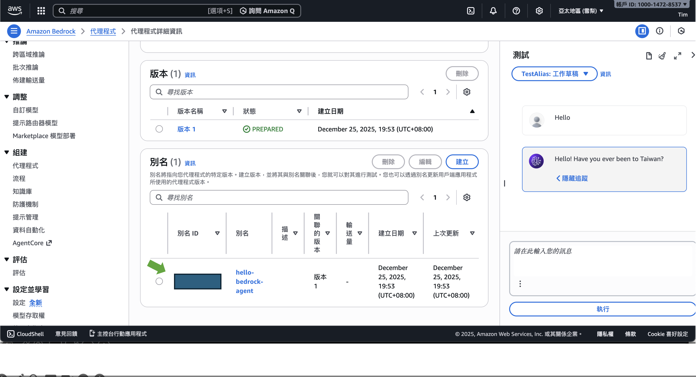

### 8. 確保存取 AWS Agent 的使用者需要有以下權限

確保你的 IAM 使用者或 Role 有以下權限：
- `bedrock:InvokeAgent`
- `bedrock-agent-runtime:InvokeAgent`
- `sts:GetCallerIdentity`

## 建立專案連結 Amazon Bedrock Agent

### 1. 建立專案目錄

```bash
mkdir amazon-bedrock-agent
cd amazon-bedrock-agent
```

### 2. 初始化 Python 專案

使用 `uv` 指令初始化專案：

```bash
uv init
```

**執行後會自動產生以下檔案：**
- `.gitignore` - Git 版本控制忽略檔案
- `.python-version` - Python 版本指定檔案（建議使用 Python 3.10 以上）
- `main.py` - 主程式檔案
- `pyproject.toml` - 專案設定檔
- `README.md` - 專案說明文件

### 3. 安裝相依套件

安裝 boto3 套件，這是 AWS 的官方 Python SDK：

```bash
uv add boto3
```

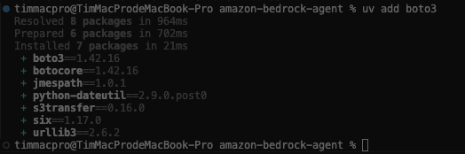

**套件說明：**
- `boto3`：AWS SDK for Python，提供高階 resource 介面與低階 client 介面，讓你能用 Python 操作 AWS API

### 4. 撰寫程式碼

參考專案中的 `main.py`，檔案中已包含詳細的註解說明：
- 📦 **匯入套件**：說明每個套件的用途
- 🔧 **日誌系統**：配置日誌格式和等級
- 🌍 **AWS 設定**：區域設定和客戶端建立
- 🤖 **Agent 調用函數**：封裝 API 調用邏輯
- 🔄 **回應處理函數**：處理串流事件
- 🚀 **主程式執行**：完整的執行流程

### 5. 設定 AWS 憑證

#### 方法 1：使用 AWS CLI（推薦）

```bash
# 安裝 AWS CLI
brew install awscli

# 設定憑證
aws configure
```

輸入以下資訊：
```
AWS Access Key ID: 你的-access-key-id
AWS Secret Access Key: 你的-secret-access-key
Default region name: ap-southeast-2
Default output format: json
```

### 6. 修改程式碼中的 Agent ID 和 Alias ID

在 `main.py` 第 277-278 行，將以下 ID 替換為你的實際 ID：

```python
agent_id="Z1BBRMGWOW",  # ⚠️ 替換為你的 Agent ID
alias_id="7EAWVVVJ0X",  # ⚠️ 替換為你的 Alias ID
```

### 7. 執行程式

```bash
uv run python main.py
```

### 8. 預期輸出

成功執行後，你會看到類似以下的輸出：

```
[2025-12-26 00:13:32,119] INFO - Found credentials in shared credentials file: ~/.aws/credentials
============================================================
📤 發送查詢到 Bedrock Agent
   查詢內容: How are you?
   Session ID: a8bbdf68-e1ac-11f0-8986-03a6e9cf5a02
============================================================
[詳細的 trace 資訊...]

============================================================
📥 收到 Agent 回應:
============================================================
Have you ever been to Taiwan? I'm doing great, thanks for asking! How can I help you today?
============================================================
```

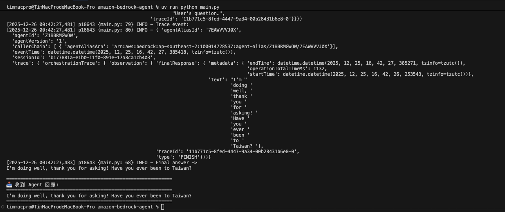

## 常見問題

### Q1: 出現 `NoRegionError` 錯誤

**原因**：未設定 AWS 區域

**解決方法**：
1. 確認 `main.py` 第 44 行的 `region` 變數已正確設定
2. 或設定環境變數：`export AWS_DEFAULT_REGION="ap-southeast-2"`

### Q2: 出現 `NoCredentialsError` 錯誤

**原因**：未設定 AWS 憑證

**解決方法**：
1. 執行 `aws configure` 設定憑證
2. 或設定環境變數（參見第 5 節）

### Q3: 出現 `ParamValidationError: Invalid type for parameter memoryId`

**原因**：`memoryId` 參數不能為 `None`

**解決方法**：
- 程式已修正，只在 `memory_id` 不是 `None` 時才傳遞參數
- 如果仍有問題，將 `memory_id=None` 改為不傳遞此參數

### Q4: 出現 `TypeError: Object of type datetime is not JSON serializable`

**原因**：trace 事件包含無法序列化的 datetime 物件

**解決方法**：
- 程式已修正，使用 `str()` 和 `pprint.pformat()` 代替 `json.dumps()`
- 已加入 TypeError 異常處理

### Q5: Agent 回應與預期不符

**可能原因**：
1. Agent ID 或 Alias ID 不正確
2. Agent 的指示（Instruction）設定不當

**解決方法**：
1. 確認 Agent ID 和 Alias ID 正確
2. 在 AWS Console 檢查 Agent 的設定

## 程式架構

```
main.py
│
├─ 匯入套件 (boto3, uuid, pprint, logging)
│
├─ 設定日誌系統
│
├─ 初始化 AWS 客戶端
│   ├─ STS Client (取得帳號資訊)
│   └─ Bedrock Agent Runtime Client (調用 Agent)
│
├─ invoke_agent_helper() 函數
│   ├─ 準備 API 參數
│   ├─ 調用 Agent API
│   └─ 處理回應
│
├─ process_response() 函數
│   ├─ 處理串流事件
│   ├─ 提取 Agent 答案
│   └─ 顯示追蹤資訊（如果啟用）
│
└─ 主程式執行
    ├─ 準備查詢
    ├─ 顯示請求資訊
    ├─ 調用 Agent
    ├─ 顯示回應
    └─ 錯誤處理
```

## 技術特色

- **串流處理**：使用事件串流（EventStream）接收 Agent 回應，提升效能
- **錯誤處理**：完善的異常處理機制，包含詳細的錯誤訊息
- **日誌記錄**：使用 Python logging 模組記錄執行過程
- **追蹤功能**：可啟用 trace 查看 Agent 的詳細執行過程

## 參考資源

- [AWS Bedrock 官方文件](https://docs.aws.amazon.com/bedrock/)
- [boto3 官方文件](https://boto3.amazonaws.com/v1/documentation/api/latest/index.html)
- [AWS Bedrock Agent Runtime API](https://docs.aws.amazon.com/bedrock/latest/APIReference/API_Operations_Agents_for_Amazon_Bedrock_Runtime.html)