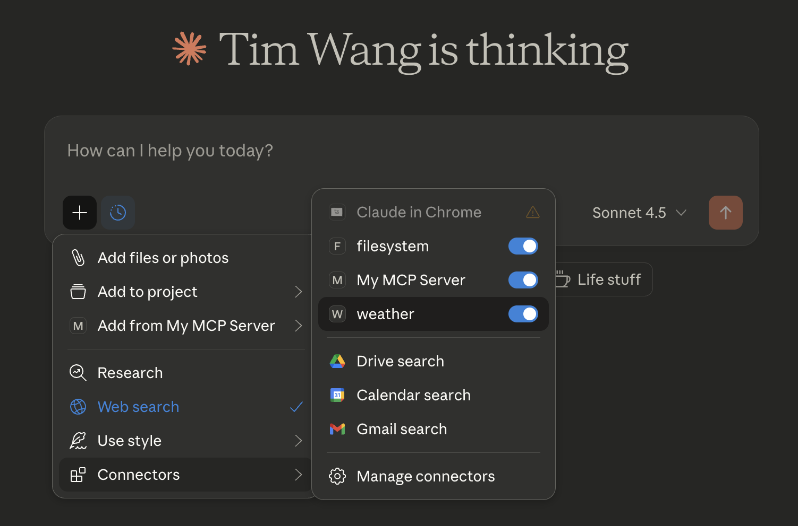
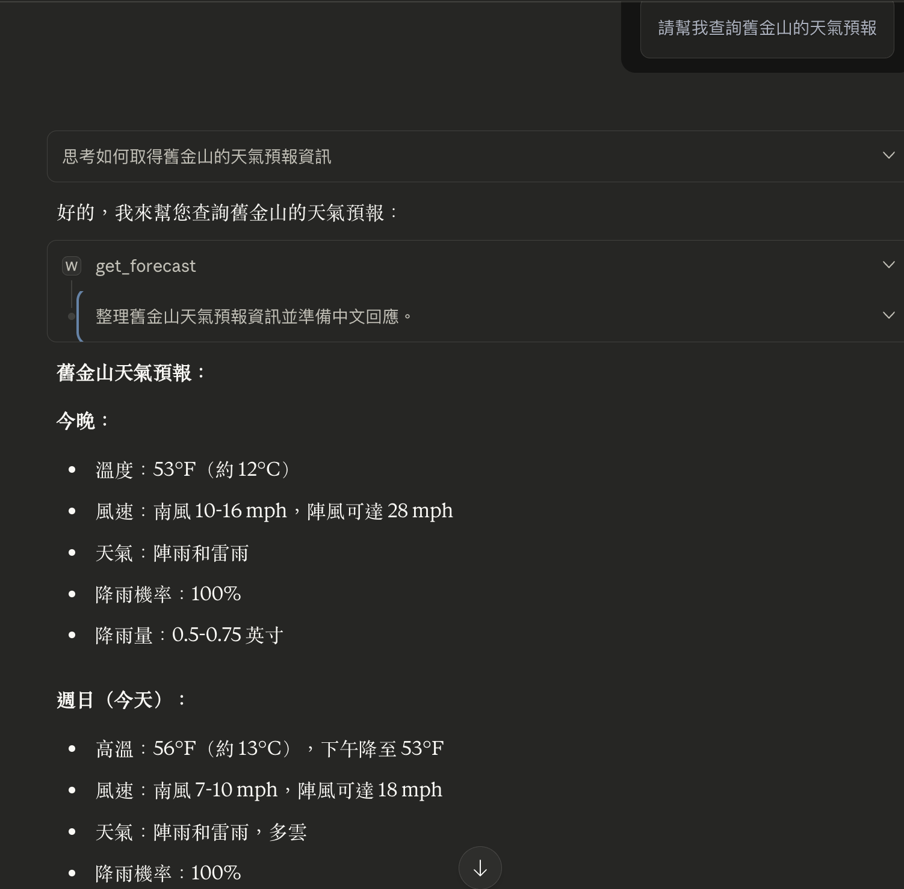
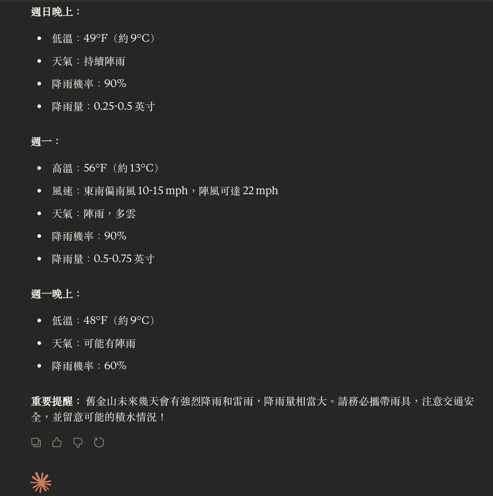
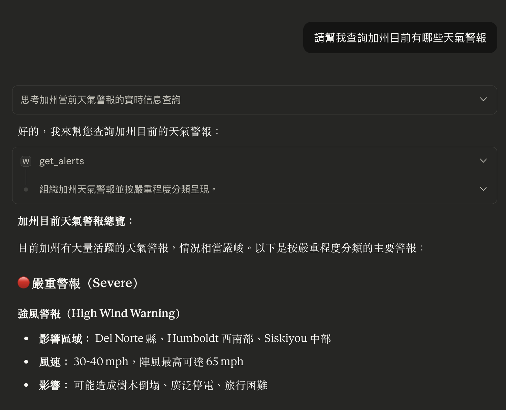
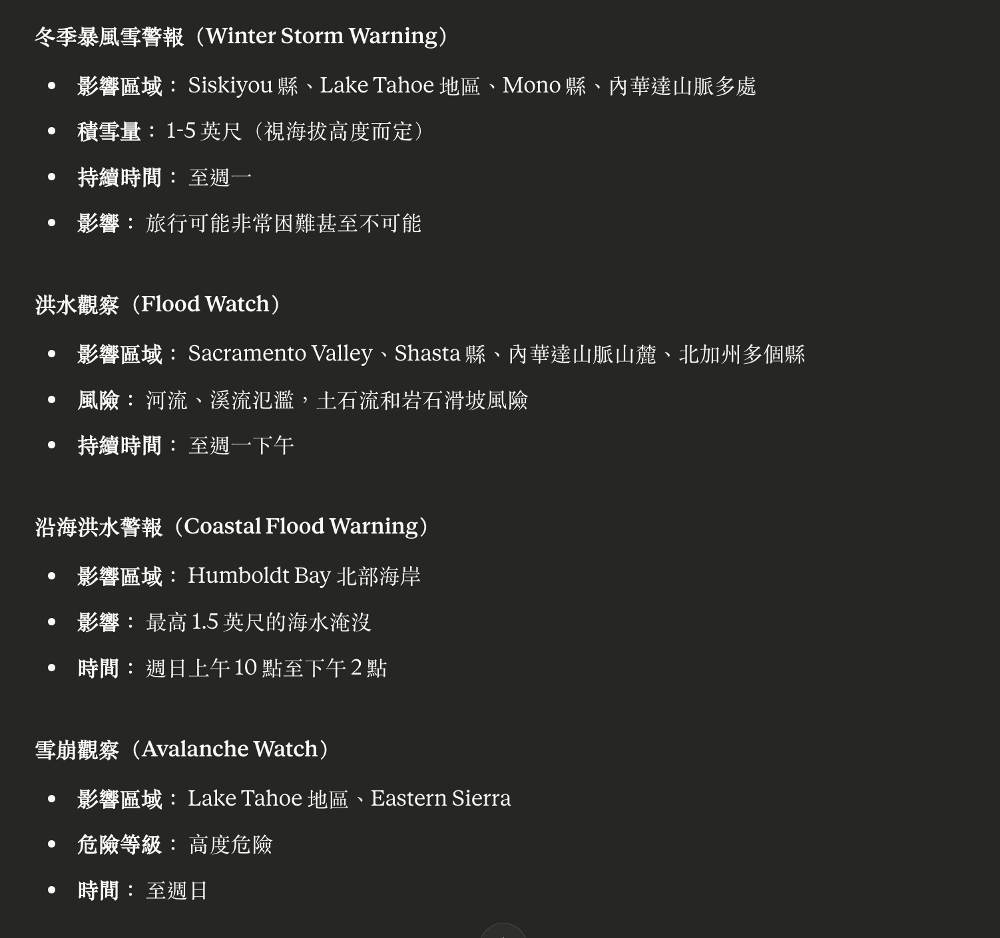
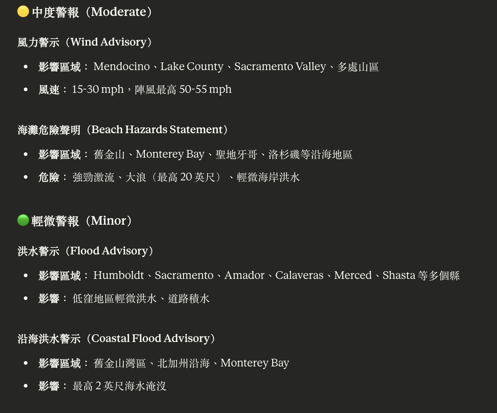
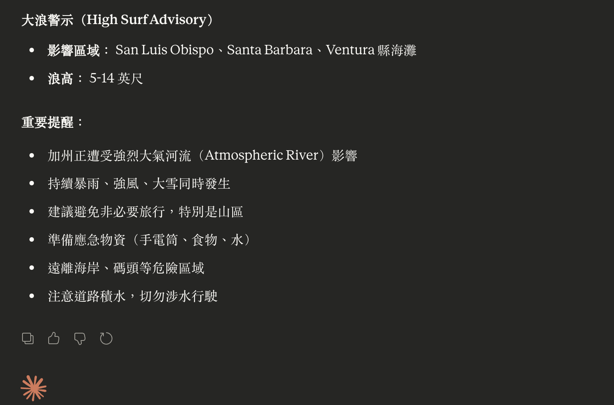

# MCP Weather Server - 美國天氣查詢服務

本專案示範如何建立一個 Model Context Protocol (MCP) 伺服器，並整合至 Claude Desktop，提供美國天氣資訊查詢功能。

## 功能特色

- 使用 FastMCP 快速建立 MCP 伺服器
- 整合美國國家氣象局 (National Weather Service) API
- 提供兩個實用的天氣查詢工具：
  - **get_forecast**: 根據經緯度查詢天氣預報
  - **get_alerts**: 查詢指定州的天氣警報
- 與 Claude Desktop 無縫整合
- 完整的錯誤處理與日誌記錄

## 環境需求

- Python 3.10+
- uv (Python 套件管理工具)
- Claude Desktop 應用程式

## 初始化專案

### 1. 建立專案目錄

```bash
mkdir mcp-weather
cd mcp-weather
```

### 2. 初始化 Python 專案

使用 uv 指令初始化專案：

```bash
uv init
```

**執行後會自動產生以下檔案：**
- `.gitignore` - Git 版本控制忽略檔案
- `.python-version` - Python 版本指定檔案
- `main.py` - 主程式檔案
- `pyproject.toml` - 專案設定檔
- `README.md` - 專案說明文件

<!-- [截圖提示] 此處可加入 uv init 執行結果的截圖 -->

### 3. 測試基本環境

執行預設的 main.py 程式以驗證環境：

```bash
uv run main.py
```

**說明：** uv 會自動建立 Python 虛擬環境，完成後會出現 `.venv` 目錄，這是虛擬環境的存放位置，預設會排除在 Git 版本控制之外。

### 4. 安裝相依套件

```bash
uv add fastmcp httpx
```

**套件說明：**
- `fastmcp`: FastMCP 框架，簡化 MCP 伺服器開發
- `httpx`: 非同步 HTTP 客戶端，用於呼叫 NWS API

<!-- [截圖提示] 此處可加入套件安裝完成的截圖 -->

### 5. 建立 MCP 伺服器程式

將 `weatherb.py` 放置於專案目錄中。此檔案包含完整的 MCP 伺服器實作，包括：
- 與 NWS API 的整合
- 兩個 MCP 工具的定義
- 完整的錯誤處理機制
- 日誌記錄功能

程式碼的詳細說明請參考 `weatherb.py` 中的註解。

## 整合 Claude Desktop

### 6. 設定 Claude Desktop MCP 配置

Claude Desktop 需要透過配置檔案來識別和載入 MCP 伺服器。

#### 6.1 找到配置檔案位置

**macOS:**
```
~/Library/Application Support/Claude/claude_desktop_config.json
```

**Windows:**
```
%APPDATA%\Claude\claude_desktop_config.json
```

#### 6.2 編輯配置檔案

在配置檔案中加入 weather MCP 伺服器設定：

```json
{
  "mcpServers": {
    "weather": {
      "command": "uv",
      "args": [
        "--directory",
        "/完整路徑/到/mcp-weather",
        "run",
        "weatherb.py"
      ]
    }
  }
}
```

**重要提示：**
- 請將 `/完整路徑/到/mcp-weather` 替換為您的專案實際路徑
- 路徑必須是絕對路徑，不可使用相對路徑或 `~` 符號
- Windows 系統請使用反斜線 `\\` 或正斜線 `/`


<!-- [截圖提示] 此處可加入 Claude Desktop 配置檔案編輯畫面的截圖 -->

#### 6.3 重新啟動 Claude Desktop

儲存配置檔案後，完全關閉並重新啟動 Claude Desktop，讓設定生效。

### 7. 驗證 MCP 伺服器連接

啟動 Claude Desktop 後，可以透過以下方式確認 MCP 伺服器是否成功載入：



## 使用範例

### 查詢天氣預報

在 Claude Desktop 中輸入：

```
請幫我查詢舊金山的天氣預報
```

Claude 會使用 `get_forecast` 工具取得未來 5 個時段的天氣預報。

```markdown
請幫我查詢舊金山的天氣預報
```




### 查詢天氣警報

在 Claude Desktop 中輸入：

```
請查詢加州（CA）目前有哪些天氣警報
```

Claude 會使用 `get_alerts` 工具取得該州的活動警報資訊。

<!-- [截圖提示] 此處可加入天氣警報查詢結果的截圖 -->






## 日誌檔案

MCP 伺服器會將所有工具呼叫和錯誤訊息記錄到 `mcp_calls.log` 檔案中，方便除錯和監控。

日誌格式範例：
```
2024-01-01T12:00:00 get_forecast latitude=37.7749, longitude=-122.4194
2024-01-01T12:00:05 get_alerts state=CA
2024-01-01T12:00:10 ERROR in get_forecast: HTTP 404 for https://api.weather.gov/...
```

## 注意事項

- **API 限制**: NWS API 僅提供美國境內的天氣資訊
- **座標範圍**: 經緯度必須在美國境內，否則 API 會返回錯誤
- **州代碼**: 查詢警報時請使用標準的兩字母州代碼（如 CA, NY, TX）
- **網路需求**: MCP 伺服器需要網際網路連線才能存取 NWS API
- **User-Agent**: NWS API 要求所有請求必須包含 User-Agent 標頭（已在程式中設定）

## 疑難排解

### MCP 伺服器無法載入

1. 確認 `claude_desktop_config.json` 中的路徑正確
2. 檢查路徑是否為絕對路徑
3. 確認 `weatherb.py` 檔案存在於指定目錄
4. 查看 Claude Desktop 的錯誤訊息

### 工具呼叫失敗

1. 檢查 `mcp_calls.log` 日誌檔案中的錯誤訊息
2. 確認網際網路連線正常
3. 驗證輸入的經緯度或州代碼格式正確
4. 嘗試直接存取 NWS API 確認服務是否正常：
   - https://api.weather.gov/points/39.7456,-97.0892
   - https://api.weather.gov/alerts/active/area/CA

### 找不到工具

1. 確認已完全重新啟動 Claude Desktop
2. 檢查配置檔案的 JSON 格式是否正確（可使用 JSON 驗證工具）
3. 確認 `uv` 指令在系統 PATH 中可執行

## 技術架構

### API 流程說明

**天氣預報查詢 (get_forecast):**
1. 接收經緯度參數
2. 呼叫 `/points/{lat},{lon}` 取得該位置的預報網格點
3. 從回應中提取預報 URL
4. 呼叫預報 URL 取得詳細預報資料
5. 格式化並返回未來 5 個時段的預報

**天氣警報查詢 (get_alerts):**
1. 接收州代碼參數
2. 呼叫 `/alerts/active/area/{state}` 取得該州的活動警報
3. 格式化並返回所有警報資訊

### 錯誤處理機制

- HTTP 錯誤（4xx, 5xx）：記錄錯誤並返回友善訊息
- 網路逾時：30 秒逾時設定，逾時後記錄並返回錯誤
- 資料格式驗證：逐步驗證 API 回應結構，避免 KeyError
- 例外捕捉：所有未預期錯誤都會被捕捉並記錄

## 參考資源

- [Model Context Protocol 規範](https://modelcontextprotocol.io/)
- [FastMCP 文件](https://github.com/jlowin/fastmcp)
- [National Weather Service API 文件](https://www.weather.gov/documentation/services-web-api)
- [Claude Desktop 文件](https://claude.ai/download)
- [httpx 文件](https://www.python-httpx.org/)

## 擴展建議

本專案可作為基礎進行擴展：

1. **新增城市名稱查詢**: 整合地理編碼 API，支援城市名稱轉經緯度
2. **快取機制**: 加入快取減少 API 呼叫次數
3. **更多資料類型**: 支援雷達圖、衛星雲圖等
4. **國際化**: 支援其他國家的天氣服務
5. **通知功能**: 主動推送嚴重天氣警報

## 參考書籍

- **AI Agent 奇幻旅程** - MCP 通往異世界金鑰
