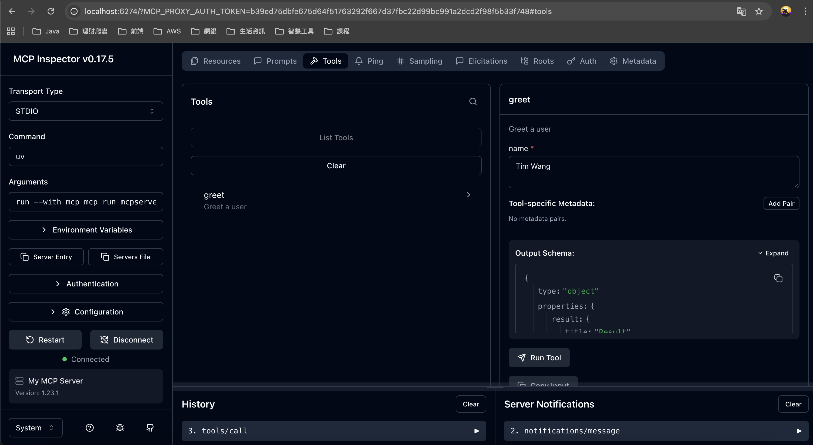

# 開發第一個 MCP Server 步驟

## 初始化專案

+ 建立專案目錄 mcpserver1
+ 切換到該目錄下
+ 使用 uv 指令初始化 Python 專案
    + 初始化專案之後會產生 .gitignore, .python-version, main.py, pyproject.toml, README.md
```
uv init
```
+ 執行 main.py 程式
    + uv 會自動建立 Python 虛擬環境．完成後會出現 .venv，這就是虛擬環境的目錄，預設會排除到 Git 管控外
```
uv run main.py
```

+ 安裝 MCP (Model Context Protocol) 的 CLI 工具套件
```
uv add "mcp[cli]"
```

+ 透過工具確認安裝完成的 MCP 工具版本
```
uv run mcp version
```

## 開發第一個 mcp server

+ 參考 mcpserverlab.py

## 啟動 mcp server

```
uv run mcp dev mcpserverlab.py
```

+ 使用指令請動 mcp 伺服器
    + mcp dev 是 MCP CLI 的子命令，表示啟動 MCP 伺服器並啟用偵錯工具
    + 若有提示需要安裝 Node.js 的 modelcontextprotocol/inspector@[version]，則必須按下 y 讓程式繼續執行．
    + 若安裝成功，執行指令後會啟動 MCP Inspector 工具，可用來測試撰寫完成的 MCP Server (ex: mcpserverlab.py)． 

    

