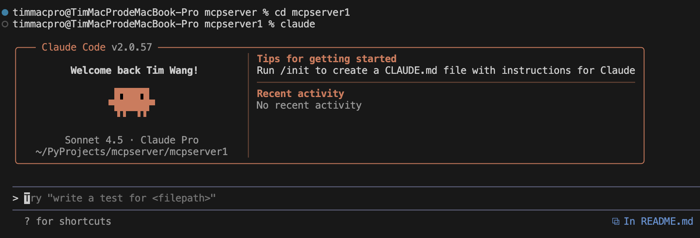
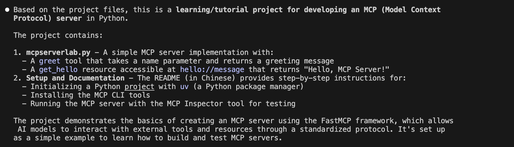
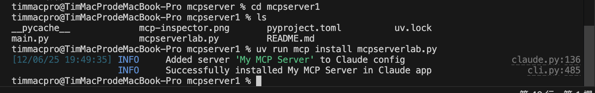
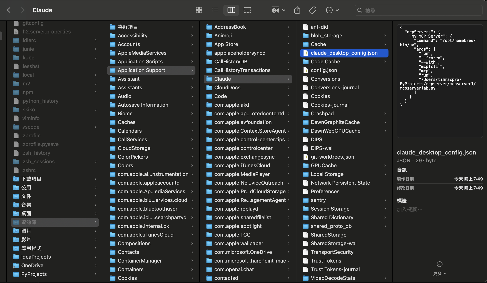
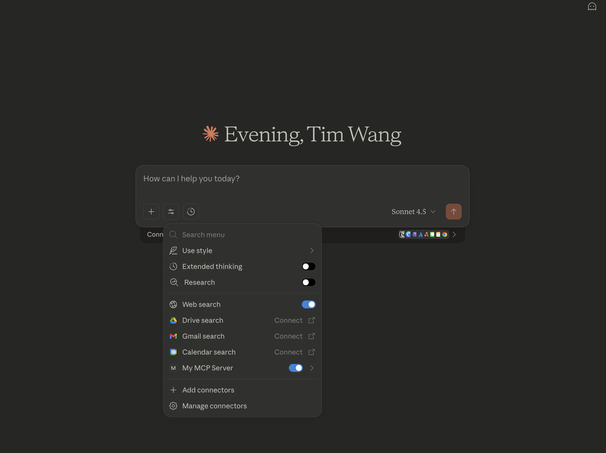
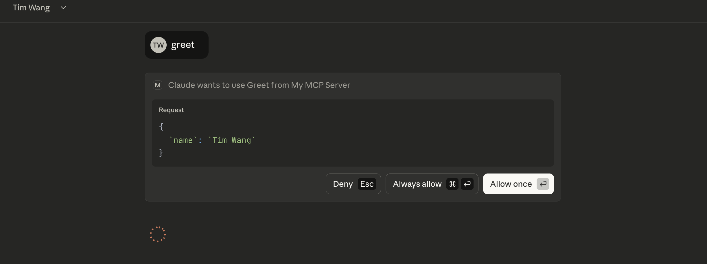
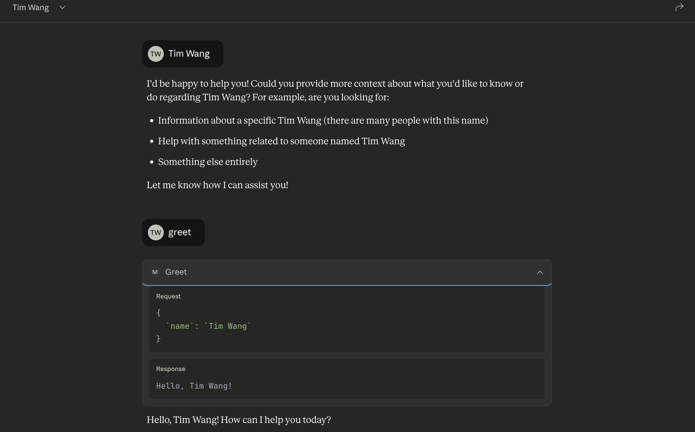

# 開發第一個 MCP Server 步驟

  The project demonstrates the basics of creating an MCP server using the FastMCP framework, which allows
   AI models to interact with external tools and resources through a standardized protocol. It's set up
  as a simple example to learn how to build and test MCP servers.

## 初始化專案

+ 建立專案目錄 mcpserver1
+ 切換到該目錄下
+ 使用 uv 指令初始化 Python 專案
    + 初始化專案之後會產生 .gitignore, .python-version, main.py, pyproject.toml, README.md
```
uv init
```
+ 執行 main.py 程式
    + uv 會自動建立 Python 虛擬環境．完成後會出現 .venv，這就是虛擬環境的目錄，預設會排除到 Git 管控外
```
uv run main.py
```

+ 安裝 MCP (Model Context Protocol) 的 CLI 工具套件
```
uv add "mcp[cli]"
```

+ 透過工具確認安裝完成的 MCP 工具版本
```
uv run mcp version
```

## 開發第一個 mcp server

+ 參考 mcpserverlab.py

## 啟動 mcp server 測試工具

```
uv run mcp dev mcpserverlab.py
```

+ 使用指令請動 mcp 伺服器測試工具
    + mcp dev 是 MCP CLI 的子命令，表示啟動 MCP 伺服器並啟用偵錯工具
    + 若有提示需要安裝 Node.js 的 modelcontextprotocol/inspector@[version]，則必須按下 y 讓程式繼續執行．
    + 若安裝成功，執行指令後會啟動 MCP Inspector 工具，可用來測試撰寫完成的 MCP Server (ex: mcpserverlab.py)． 


## 啟用 Claude 桌面應用程式

+ 安裝 Claude Desktop (自官網下載安裝)
+ 啟用 Claude
    + 於終端機視窗進入專案資料夾
    + 執行 Claude 指令啟用 Claude



## 詢問 Claude 第一個問題

+ 詢問 Claude : What does the project do?



## 啟用 MCP Server並註冊至 Claude Desktop
```
uv run mcp install mcpserverlab.py
```


這道指令用於安裝並啟動 MCP Server，與 Claude Desktop 桌面應用程式並無直接關係．然而 mcp CLI 會依據作業系統找出 claude_desktop_config.json 檔案，並且會在這個設定檔內新增(或更新)這筆 MCP Server 連線資訊，Claude Desktop 桌面應用程式會以 JSON_RPC 2.0 格式或 STDIO 進行通訊．
設定檔於 Mac OS 環境的路徑如下圖：



從 json config 內容可發現，Claude Desktop 應用在與 MCP Server 建立連線時，並不是採用 HTTP 協議，而是直接透過 uv 執行 MCP Server Python 程式．因此一但路徑錯誤或是沒有安裝 uv，就會無法順利連線．

## 從 Claude Desktop 驗證 MCP Server



若 MCP Server 有被順利安裝與註冊，重新啟動 Claude Desktop 就會看到一個 Tool 可使用．

任意輸入ㄧ姓名送出，Claude 會自動辨識使用者意圖，並且調用工具，第一次使用工具會需要使用者確認是否執行．



工具調用成功後，在Claude Desktop 除了會顯示來自工具的回應外，其調用過程的 Request 與 Response 資訊也會一併呈現．


