## 初始化專案

### 1. 建立專案目錄

```bash
mkdir mcpserver2
cd mcpserver2
```

### 2. 初始化 Python 專案

使用 uv 指令初始化專案：

```bash
uv init
```

**執行後會自動產生以下檔案：**
- `.gitignore` - Git 版本控制忽略檔案
- `.python-version` - Python 版本指定檔案
- `main.py` - 主程式檔案
- `pyproject.toml` - 專案設定檔
- `README.md` - 專案說明文件

### 3. 安裝套件

```bash
uv add fastapi uvcorn mcp
```
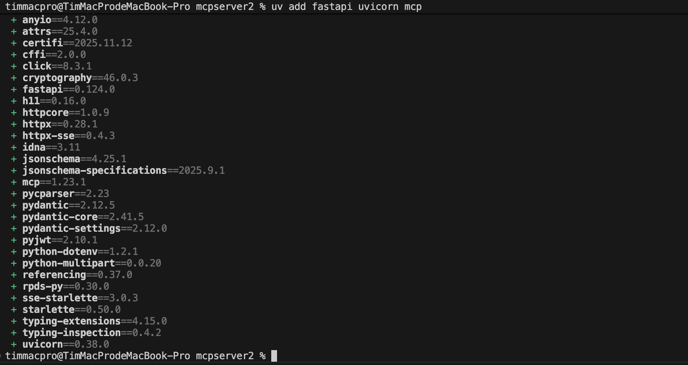

### 4. 撰寫程式碼

### 5. 執行程式碼
```bash
uv run python main.py
```
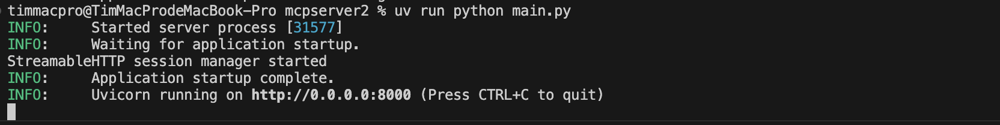

### 6. 使用 ngrok 開啟本地端對外連線

install ngrok via Homebrew with the following command:
```bash
brew install ngrok
```
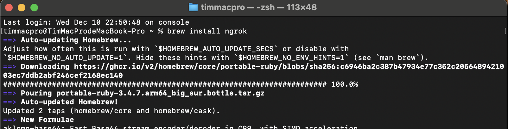

前往 ngrok 官方網站註冊並取得Authtoken．這個設定可再登入 ngrok 官網後的 dashboard 上看到．

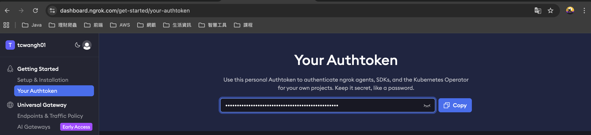

Authenticate the ngrok agent. this saves your Authtoken to the default configuration file so you only have to do it once.

```bash
ngrok config add-authtoken 
```
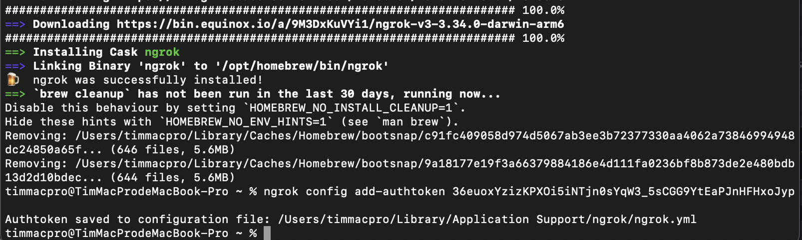

安裝好的路徑檔如下

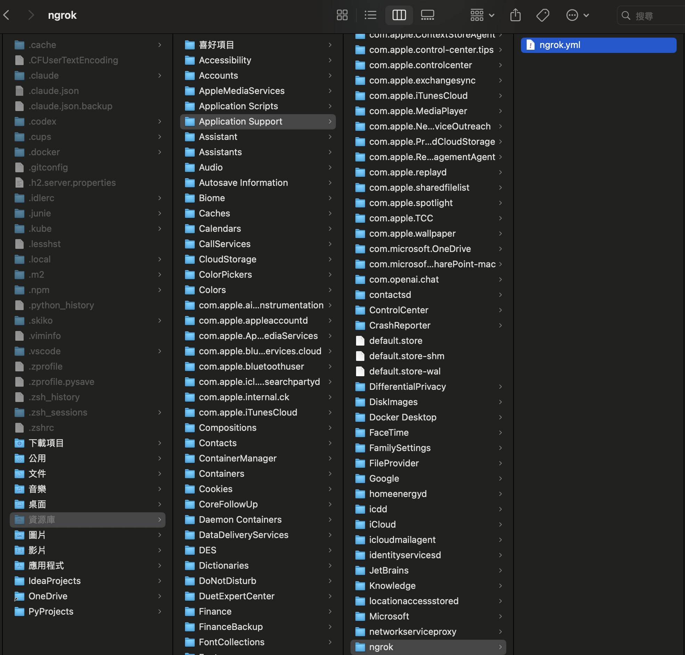

檔案內容為

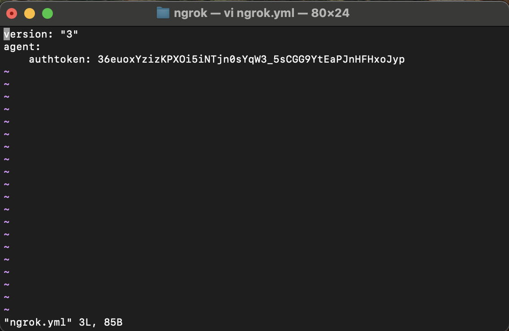

於終端機啟動 ngrok HTTP 通道，指令如下

```bash
ngrok http 8000
```
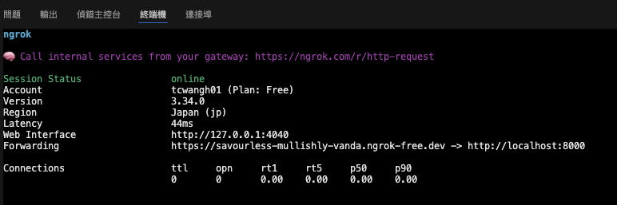

這個指令會建立一個公開的臨時網域，並將進來的 HTTP 臨時請求轉發到本地的 8000 埠．

### 7. 從ngrok 開發者網域查看本地啟動的應用程式

設定好並啟動 ngrok 後, 可由 ngrok 提供的測試網域查詢已啟動在本機端的應應程式

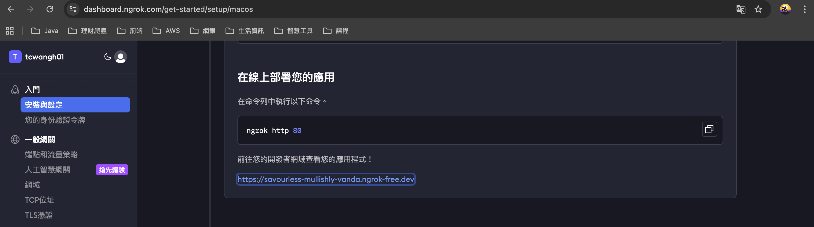

ngrok 上會顯示啟動於本機 Port 8000 網路伺服器回傳的訊息

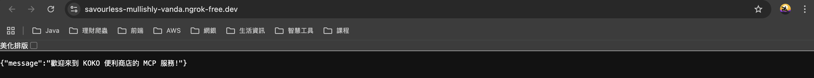

### 8. 使用 OpenAI 平台測試 MCP server

請至網址 https://platform.openai.com/docs/overview 登入 Open AI Developer


### 9. 建立 Prompt 並外掛 MCP Server
在左邊工具列上選取 Chat 後, 點擊右邊視窗內的 Create 按鈕, 建立新的 Prompt


在 Tools 設定中選擇新增 MCP Server

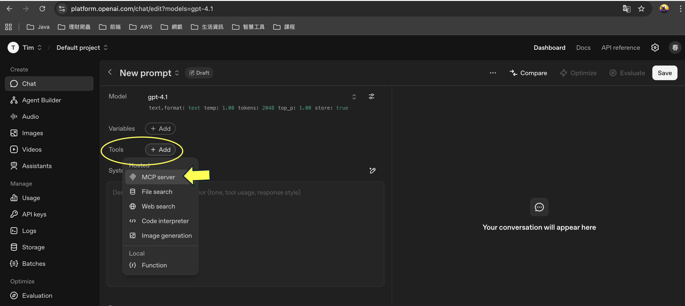

選擇 +Server

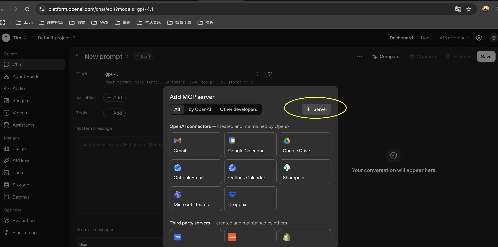

設定 Server URL, 這邊就根據 ngrok 提供的網址來做更改與調整，這邊使用 https://savourless-mullishly-vanda.ngrok-free.dev/mcp；
設定後點擊 Connect．

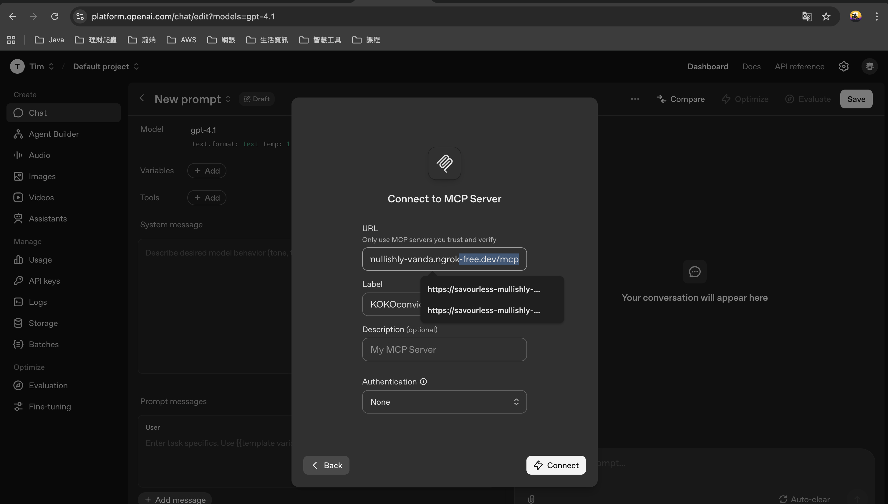

若設定正確，OpenAI已經可以正確拿到我們做的 MCP 伺服器所提供的 Tool 了，參考下圖：

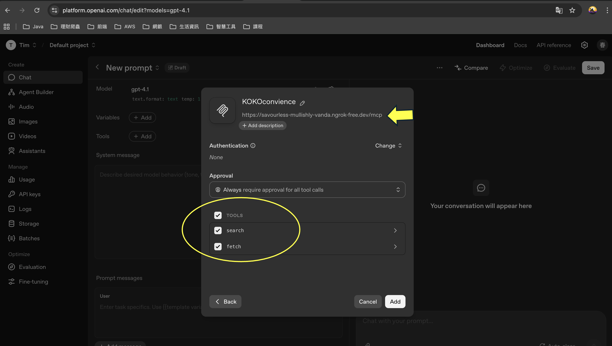

建立好的 Prompt 如下圖

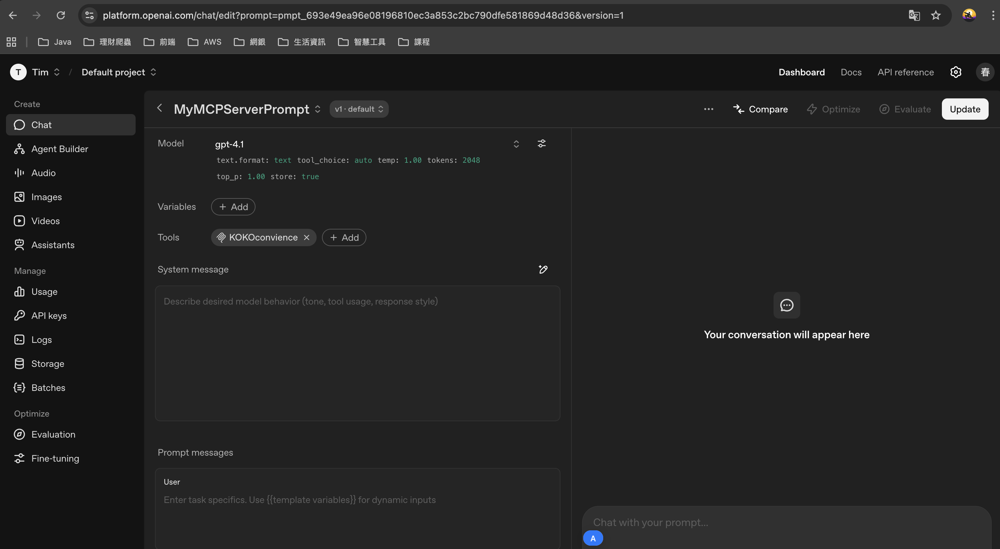

### 10. 透過對話取得 MCP Server 回傳結果

於 Prompt 的使用者對話視窗中輸入 KOKO便利店的茶葉蛋還有幾個

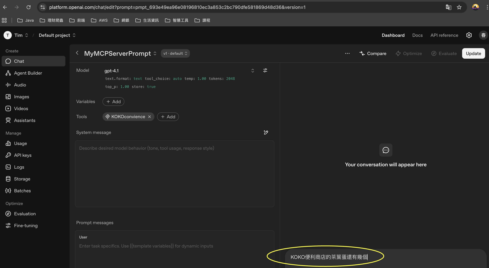

OpenAI 會找到 MCP Tools 並詢問使用者是否同意調用 MCP Tools，選擇 approve．

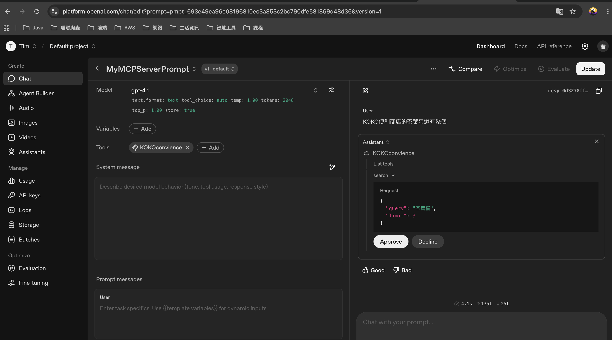

OpenAI 詢問完 MCP tools 後，取得結果並回答．

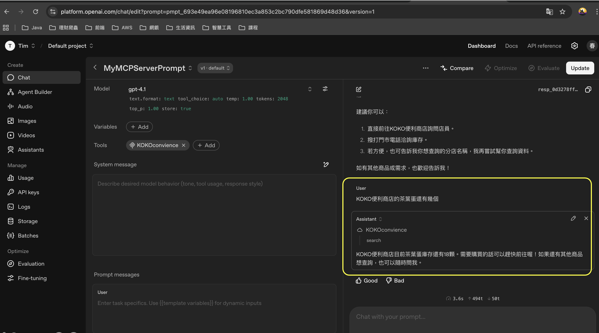

