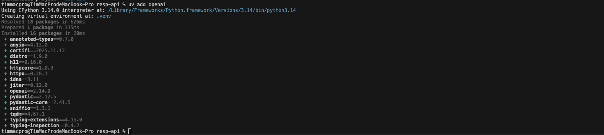
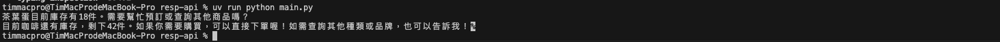

# OpenAI Responses API 整合範例

## 專案簡介

這是一個基於 **OpenAI Responses API** 的整合範例專案，展示如何使用 OpenAI 的 Responses API 與 **MCP (Model Context Protocol) Server** 連接，實現智能化的庫存查詢系統。

### 主要目的

本專案旨在示範以下核心概念和技術：

1. **OpenAI Responses API 使用**：展示如何使用最新的 Responses API 進行 AI 對話
2. **非串流 vs 串流回應**：比較兩種不同的 API 呼叫模式及其應用場景
3. **MCP 工具整合**：透過 MCP 協定連接外部服務，擴展 AI 模型的能力
4. **非同步程式設計**：使用 Python asyncio 實現高效能的非同步操作
5. **即時資料查詢**：展示如何讓 AI 模型存取即時的外部資料源

## 核心功能

### 1. 非串流式 API 呼叫
- **特點**：等待模型完成全部生成後，一次性返回完整結果
- **適用場景**：需要完整回應再進行後續處理的情況
- **範例**：查詢「茶葉蛋還有多少庫存」

### 2. 串流式 API 呼叫
- **特點**：模型逐步生成內容，即時返回文字片段
- **適用場景**：需要即時顯示回應內容，提升使用者體驗
- **範例**：查詢「咖啡還有嗎」，逐字顯示回應

### 3. MCP 工具整合
- **連接目標**：KOKO-Store MCP Server
- **功能**：提供即時庫存查詢能力
- **協定**：使用 MCP (Model Context Protocol) 標準化通訊
- **授權模式**：設定為 `never` - 無需使用者批准即可執行

## 使用場景範例

本專案包含兩個實際測試案例：

1. **非串流庫存查詢**：「茶葉蛋還有多少庫存」
   - 完整等待回應後輸出
   - 適合需要完整資訊再處理的場景

2. **串流式庫存查詢**：「咖啡還有嗎」
   - 即時逐字顯示回應
   - 提供更好的互動體驗

## 安裝步驟

### 1. 建立專案目錄

```bash
mkdir resp-api
cd resp-api
```

### 2. 初始化 Python 專案

使用 `uv` 指令初始化專案：

```bash
uv init
```

**執行後會自動產生以下檔案：**
- `.gitignore` - Git 版本控制忽略檔案
- `.python-version` - Python 版本指定檔案（建議使用 Python 3.10 以上）
- `main.py` - 主程式檔案
- `pyproject.toml` - 專案設定檔
- `README.md` - 專案說明文件

### 3. 安裝相依套件

安裝 OpenAI SDK：

```bash
uv add openai
```

**主要套件說明：**
- `openai`：OpenAI 官方 Python SDK，提供 Responses API 支援



### 4. 撰寫程式碼

參考專案中的 `main.py`，主要包含：
- 環境設定與 API 金鑰載入
- OpenAI AsyncClient 初始化
- MCP 工具配置（連接 KOKO-Store）
- 非串流式 API 呼叫範例
- 串流式 API 呼叫範例

### 5. 申請 OpenAI API Key

1. 前往 [OpenAI Platform](https://platform.openai.com/)
2. 登入後進入 API Keys 頁面
3. 點擊「Create new secret key」建立新的 API 金鑰
4. 妥善保存金鑰（只會顯示一次）

### 6. 設定環境變數

將 OpenAI API Key 設定為環境變數：

```bash
export OPENAI_API_KEY="your-api-key-here"
```

或在專案根目錄建立 `.env` 檔案：
```
OPENAI_API_KEY=your-api-key-here
```

### 7. 啟動 MCP Server

本專案需要連接外部的 MCP Server（`mcpserver2`）提供庫存查詢功能。

**啟動前置作業：**
1. 確認 `mcpserver2` 專案已經啟動
2. 使用 ngrok 建立反向代理，將本地 MCP Server 暴露到公網
3. 將 ngrok 提供的 URL 更新到 `main.py` 的 `tools` 設定中

```python
tools = [
    {
        "type":"mcp",
        "server_url":"https://your-ngrok-url.ngrok-free.dev/mcp",  # 更新為您的 ngrok URL
        "server_label":"KOKO-Store",
        "require_approval": "never"
    }
]
```

### 8. 執行程式

一切就緒後，透過以下指令執行程式：

```bash
uv run python main.py
```

**程式執行流程：**
1. 載入 OpenAI API 金鑰並建立客戶端
2. 執行非串流查詢：查詢茶葉蛋庫存（完整輸出）
3. 執行串流查詢：查詢咖啡庫存（逐字輸出）

程式執行結果：




## API 模式比較

| 特性 | 非串流模式 | 串流模式 |
|------|----------|---------|
| **回應方式** | 一次性完整輸出 | 逐步即時輸出 |
| **使用者體驗** | 需等待完整結果 | 即時看到生成過程 |
| **適用場景** | 批次處理、完整分析 | 聊天介面、即時互動 |
| **程式複雜度** | 較簡單 | 需處理串流事件 |
| **範例查詢** | 茶葉蛋庫存 | 咖啡庫存 |

## 參考資源

- [OpenAI API 參考文件](https://platform.openai.com/docs/)
- [OpenAI Python SDK](https://github.com/openai/openai-python)
- [Model Context Protocol (MCP)](https://modelcontextprotocol.io/)
- [Async Programming in Python](https://docs.python.org/3/library/asyncio.html)

## 參考書籍

- **AI Agent 奇幻旅程** - MCP 通往異世界金鑰

## 專案結構

```
resp-api/
├── main.py              # 主程式檔案（包含詳細註解）
├── README.md            # 專案說明文件
├── pyproject.toml       # 專案設定檔
├── .python-version      # Python 版本指定
├── .gitignore           # Git 忽略設定
└── docs/                # 文件資料夾
    ├── openai-packages.png
    └── exec-result.png
```

## 學習重點

1. **理解 Responses API**：掌握 OpenAI 最新的 Responses API 使用方式
2. **非同步程式設計**：學習使用 `async/await` 處理異步操作
3. **串流處理技巧**：理解如何處理 `ResponseTextDeltaEvent` 事件
4. **MCP 工具整合**：了解如何透過 MCP 擴展 AI 模型能力
5. **實務應用場景**：將 AI 整合到實際的庫存查詢系統中
